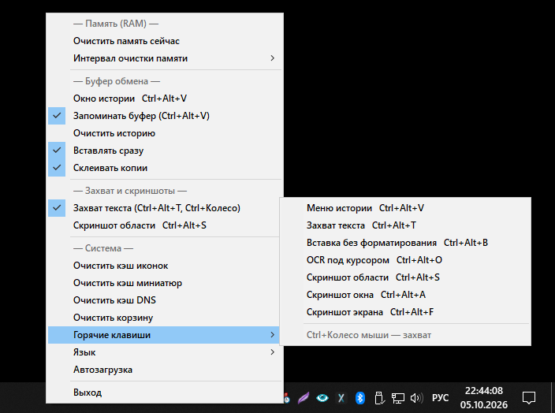

# MemClip


[](https://github.com/Yogiru/MemClip/releases/latest)

Утилита «3 в 1» для Windows: очистка оперативной памяти (на базе MemCleaner) + история буфера обмена (идея CLCL) + захват текста с любых элементов интерфейса (идея Textify). Работает из системного трея, не создаёт консольного окна.

## Скачать

Готовый `MemClip.exe` — в разделе [Releases](https://github.com/Yogiru/MemClip/releases/latest). Установка не требуется: положите exe в любую папку и запустите (настройки и история создаются рядом с ним). Программа запрашивает права администратора — они нужны для очистки системной памяти.

**Документация:** [USER_GUIDE.md](USER_GUIDE.md) — справка и инструкция для пользователя; [DEVELOPER.md](DEVELOPER.md) — архитектура и руководство разработчика.



## Что делает

### Очистка памяти

- Уменьшает рабочие наборы процессов (`EmptyWorkingSet`).
- Очищает standby-списки физической памяти.
- Сбрасывает системный файловый кеш.
- Показывает, сколько свободной памяти стало доступным после очистки.
- Пункт «Очистить кэш иконок и миниатюр» (`iconcache*.db` + `IconCache.db` + `thumbcache*.db`); если файлы заблокированы Explorer'ом — перезапускает его от имени интерактивного пользователя (не от админа).
- Запускается с правами администратора (UAC-манифест встроен).

### История буфера обмена

- Следит за буфером через `AddClipboardFormatListener` (современная замена цепочки `SetClipboardViewer` из CLCL).
- Запоминает до 30 последних записей. Каждая запись хранит **все полезные форматы сразу** (как в CLCL), поэтому ничего не теряется:
  - текст — `CF_UNICODETEXT` (+ `Rich Text Format` и `HTML Format` — форматирование сохраняется при вставке в Word и т.п.);
  - картинки — `CF_DIB` и `CF_DIBV5` (система сама синтезирует их из `CF_BITMAP`), `CF_ENHMETAFILE` (вектор), а также зарегистрированные `PNG`, `JFIF`, `GIF`, `image/png`;
  - файлы — `CF_HDROP`.
- При выборе записи из истории все форматы возвращаются в буфер одновременно — целевая программа сама берёт лучший.
- Если у записи-картинки нет PNG, он синтезируется через GDI+ (`DIB → PNG`) — так картинку принимают браузеры и мессенджеры.
- Запись-файл с одним изображением (png/jpg/gif/bmp/tif) дополнительно получает `CF_BITMAP` + `PNG` — файл можно вставить как картинку в Paint, мессенджер и т.д.
- `OpenClipboard` повторяется с ретраями — обновления не теряются, пока источник держит буфер открытым.
- Записи-картинки показывают миниатюру прямо в меню истории (32 px, через GDI+).
- **Закреплённые записи** — Shift+клик по записи в меню истории (или кнопка «Закрепить» в окне истории) закрепляет её: такие записи помечены ★, стоят вверху списка и не вытесняются новыми копиями.
- **Вставка без форматирования** — Ctrl+клик по записи восстанавливает только `CF_UNICODETEXT` (без RTF/HTML), отдельный хоткей «Вставить как текст» (по умолчанию Ctrl+Alt+B) очищает текущий буфер до чистого текста и вставляет.
- **Окно истории с поиском** — Ctrl+Alt+V открывает окно: строка поиска фильтрует записи (по тексту, а у картинок — ещё и по распознанному OCR-тексту внутри них), миниатюры, кнопки «Вставить» / «Как текст» / «Закрепить» / «Удалить». ПКМ по записи — контекстное меню (вставить / как текст / закрепить / **сохранить как…** (PNG/TXT) / удалить), клавиша Delete удаляет выбранную. Каждая запись показывает время и программу-источник (`14:32 · notepad.exe`).
- **Склейка копий** — пункт «Склеивать копии»: несколько Ctrl+C подряд (в течение 15 с) объединяются в одну текстовую запись через перевод строки.
- **Исключения по процессам** — INI-ключ `[clipboard] exclude=keepass.exe;...` исключает буфер указанных программ из истории.
- **Размер истории** — INI-ключ `[clipboard] max=N` (5–256, по умолчанию 30; закреплённые не в счёт). **Срок хранения** — `[clipboard] keep_days=N` удаляет записи старше N дней (0 — выкл, закреплённые не трогает).
- Дубликат поднимается наверх списка.
- Игнорирует данные с маркерами `ExcludeClipboardContentFromMonitorProcessing`, `Clipboard Viewer Ignore` и `CanIncludeInClipboardHistory=0` — пароли из менеджеров паролей в историю не попадают.
- История сохраняется в `MemClip.dat` рядом с exe и восстанавливается после перезапуска (формат `MCL4` с метаданными, читаются `MCL2`/`MCL3`).
- Записи больше 8 МБ на формат пропускаются.

### Захват текста

- По `Ctrl+Средний клик мыши` или `Ctrl+Alt+T` открывается окно с текстом элемента под курсором (как в Textify): заголовки окон, кнопки, метки, текст ошибок и т.п.
- В окне можно выделить нужную часть и нажать «Копировать» (или Enter) — в буфер попадёт выделенное (или весь текст, если ничего не выделено). Esc — отмена.
- Захват идёт в три слоя: UI Automation (`IUIAutomation.ElementFromPoint` + `RawViewWalker`, покрывает Chrome/Edge/Office/Electron/WPF) → MSAA (`AccessibleObjectFromPoint` из oleacc.dll) с подъёмом по родителям в пределах одного процесса → запасной вариант через `WM_GETTEXT`/`GetWindowText`.
- **URL под курсором** — `Ctrl+Alt+средний клик`: захваченный текст сканируется на `http(s)://`/`www.` — найденный URL сразу копируется в буфер без окна.
- **OCR** — `Alt+средний клик` или хоткей (по умолчанию Ctrl+Alt+O): рамка элемента под курсором (UIA BoundingRectangle) захватывается с экрана и распознаётся через `Windows.Media.Ocr` (WinRT). Требует установленного языкового пакета OCR (Параметры → Приложения → Дополнительные компоненты → «Распознаватель текста»).
- Скопированный текст автоматически попадает в историю буфера.

### Скриншоты области экрана (аналог Lightshot)

- По хоткею (по умолчанию `Ctrl+Alt+S`) или пункту меню «Скриншот области» открывается затемнённый оверлей на весь экран (все мониторы): протяните рамку выделения — область подсвечивается, показывается размер. После отпускания рамку можно **подогнать**: тянуть края/углы, drag внутри — переместить, стрелки — попиксельно (Shift — по 10 px). **Enter** фиксирует выбор и выполняет действие по модификаторам (те же, что при отпускании); Esc — отмена.
- **Отпускание кнопки** — мини-редактор разметки как в Lightshot: инструменты «Карандаш» / «Линия» / «Стрелка» / «Рамка» / «Текст» / «Размытие», палитра из 6 цветов, Ctrl+Z («Назад»), «Сбросить» возвращает исходник, «Копировать»/«Сохранить» коммитят результат (CF_BITMAP + PNG, попадает в историю), «Отмена»/Esc — выход.
- **+Alt при отпускании** — сразу в буфер, без редактора.
- **+Ctrl при отпускании** — OCR выделенной области (текст откроется в окне захвата).
- **+Shift при отпускании** — сохранение PNG в `screenshots\` рядом с exe + копирование в буфер.
- **Скриншот активного окна** — `Ctrl+Alt+A`; **всего экрана** (все мониторы) — `Ctrl+Alt+F`. Открываются в редакторе разметки; с нажатым `Shift` — сразу в буфер. **Повтор последней области** — `Ctrl+Alt+Shift+S`: мгновенный снимок той же области в буфер.
- **Автовставка из редактора** — кнопка «Копировать» кладёт результат в буфер и (при включённой «Вставлять сразу») сразу вставляет в окно, из которого делался снимок.
- **Esc или правая кнопка** — отмена.

## Управление

### Горячие клавиши

- **Ctrl+Alt+V** — окно истории буфера с поиском и миниатюрами. Выбор записи кладёт её в буфер и (при включённой «Вставлять сразу») сразу вставляет в активное окно (эмуляция Ctrl+V).
- **Ctrl+Alt+T** — окно захвата текста под курсором.
- **Ctrl+Alt+B** — вставить содержимое буфера как чистый текст (без форматирования).
- **Ctrl+Alt+O** — OCR элемента под курсором.
- **Ctrl+Alt+S** — скриншот области экрана (оверлей выделения).
- **Ctrl+Alt+A** — скриншот активного окна (в редактор; +Shift — сразу в буфер).
- **Ctrl+Alt+F** — скриншот всего экрана (в редактор; +Shift — сразу в буфер).
- **Ctrl+Alt+Shift+S** — повтор последней области (сразу в буфер).
- **Ctrl+средний клик** — захват текста; **Ctrl+Alt+средний клик** — скопировать URL; **Alt+средний клик** — OCR (жесты фиксированы).
- В меню истории: **Shift+клик** — закрепить/открепить запись, **Ctrl+клик** — вставить как чистый текст.
- Клавиатурные комбинации меняются: меню трея → **Горячие клавиши** → выбор пункта → нажать новое сочетание (обязателен модификатор Ctrl/Alt/Shift/Win). Сохраняется в `MemClip.ini` рядом с exe.

### Главное меню (правая кнопка по значку в трее)

Меню разбито на группы с заголовками:

- **Память (RAM)** — «Очистить память сейчас» и «Интервал очистки памяти»
  («Вручную» или период 1/5/10/30/60 минут). Тултип иконки всегда показывает
  загрузку памяти и свободный объём (обновляется раз в 4 с); порог автоочистки
  настраивается ключом `[main] mem_free_min_mb=N` в INI (0 = выкл).
- **Буфер обмена** — «Окно истории» (Ctrl+Alt+V), «Запоминать буфер»,
  «Очистить историю», «Вставлять сразу», «Склеивать копии».
- **Захват и скриншоты** — «Захват текста» (вкл/выкл) и
  «Скриншот области» (Ctrl+Alt+S).
- **Система** — «Очистить кэш иконок и миниатюр»
  (при необходимости перезапускает Explorer), «Проверить обновления»,
  «Радио» (фоновые станции для концентрации + громкость),
  «Горячие клавиши», «Язык» (Авто/RU/UK/BE/EN),
  «Автозагрузка» (задача Планировщика `MemClip`), «Выход».

Сам список записей истории показывается по левому клику по иконке —
в меню настроек он не дублируется.

### Левый клик и двойной клик по значку

- **Одиночный** — меню истории буфера обмена.
- **Двойной** — немедленная очистка памяти.

## Параметры командной строки

- `MemClip.exe /clean` — разовая очистка и выход.
- `MemClip.exe /install` — добавить в автозагрузку и выйти.
- `MemClip.exe /uninstall` — удалить из автозагрузки и выйти.
- `MemClip.exe -a<N>` — автозагрузка + интервал N минут (макс. 120).

## Язык интерфейса

Русский / украинский / белорусский / английский. По умолчанию — по языку
системы; вручную выбирается в меню **Система → Язык** (сохраняется в INI,
`[main] lang=auto|ru|uk|be|en`).

## Сборка из исходников

Требуется Free Pascal Compiler (FPC) 3.2.2 и `fpcres`.

```powershell
cd C:\proj\MemClip
C:\lazarus\fpc\3.2.2\bin\i386-win32\fpcres.exe -of res -o MemClip.res MemClip.rc
C:\lazarus\fpc\3.2.2\bin\i386-win32\fpc.exe -O2 MemClip.pas
```

или просто `build.cmd`. Результат — `MemClip.exe`.

## Важные примечания

- Если Ctrl+Alt+V / Ctrl+Alt+T заняты другой программой, хоткей не зарегистрируется — используйте меню трея.
- «Вставлять сразу» эмулирует Ctrl+V — в окнах, где вставка не поддерживается, ничего не произойдёт.
- История хранится открытым текстом в `MemClip.dat`.
